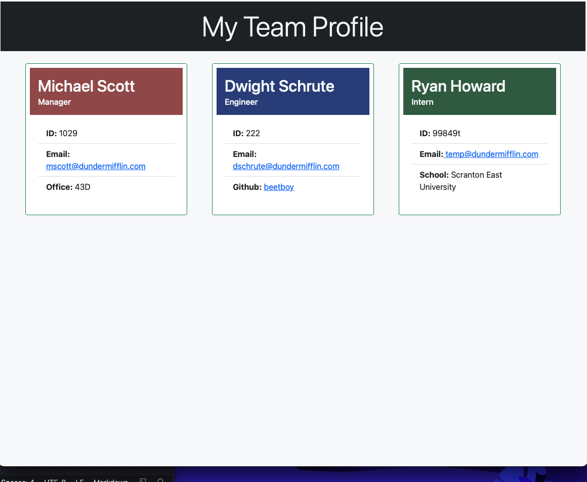

# team-profile-generator
  ### Created by: Ben Kasper

  ## Description
  This is an application run out of the terminal that will generate an HTML page with built-in styling that displays a team profile based on the user's inputs of tem members. 

  ## Application Screenshots, Links and Demo
 
  #### Screenshot
  

  #### Link to demo video
  https://youtu.be/Gk-zDZM-wAE

  #### Link to the Github Repo
  https://github.com/bckasper/team-profile-generator 

  #### Link to a sample HTML file screenshot
  https://github.com/bckasper/team-profile-generator/blob/main/src/Screen%20Shot%202021-10-06%20at%2010.53.04%20PM.png 

  ## Installation
  The user needs access to their terminal, the files in this directory, and have node.js installed on their machine. They will also need to install the inquirer and jest packages if they had not already done so.

  ## Usage
  This program runs entirely out of the terminal. To run it: 
  
  1. The user will first open a terminal session. 
  2. Then they will navigate to the directory where this application is run out of. 
  3. Then, by typing the command "node index.js" they will begin running the application. 
  4. The user will enter their answers for a series of prompts, and then the application will render an HTML file.
  5. The application finishes running once the user has selected "Finish," indicating that they have no more employees to enter.
  6. The HTML file will include built-in styling and display a team profile site based on the employees the user entered into the prompts.

  ## Technology used
  The follow are assets that were used in creating this application:

  - HTML, CSS and JavaScript
  - Bootstrap was used as the framework for the CSS styling (minor customizations were made directly in-line within the HTML file)
  - This application is run using Node.js (fs was used to write the generated file); enter "node index.js" to run the application
  - There are tests for this application that utilize Jest (enter "npm run test" in the command line to see testing)
  - npm Inquirer was used to run the user prompts in the command line
  

  ## Questions
  Questions? Please visit my Github to view code and/or send me a message at https://github.com/bckasper
